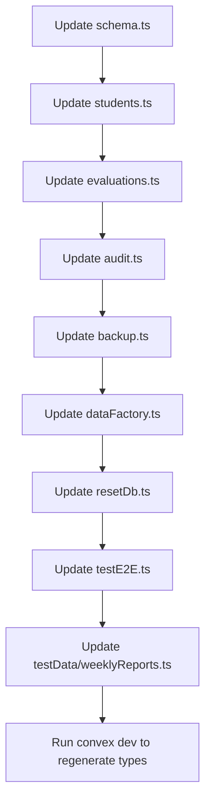

# Refactoring Plan: Rename 'chineseName' to 'nativeName'

## Overview

This document outlines a comprehensive plan to rename the `chineseName` field to `nativeName` in the `students` table and propagate this change throughout the entire application stack.

## Scope Analysis

### Files Affected (by category)

#### 1. Database Schema (1 file)

- [`src/convex/schema.ts`](src/convex/schema.ts:46) - Core schema definition

#### 2. Backend Logic - Convex Functions (12 files)

- [`src/convex/students.ts`](src/convex/students.ts) - Student CRUD operations
- [`src/convex/evaluations.ts`](src/convex/evaluations.ts:316-337) - Evaluation student data
- [`src/convex/audit.ts`](src/convex/audit.ts:23-25) - Audit log student info
- [`src/convex/backup.ts`](src/convex/backup.ts:77-79) - Backup data structure
- [`src/convex/dataFactory.ts`](src/convex/dataFactory.ts) - Test data generation
- [`src/convex/resetDb.ts`](src/convex/resetDb.ts:78-108) - Database seeding
- [`src/convex/testE2E.ts`](src/convex/testE2E.ts:97-441) - E2E test data
- [`src/convex/testData/weeklyReports.ts`](src/convex/testData/weeklyReports.ts:93-129) - Weekly report test data

#### 3. Frontend Components (4 files)

- [`src/routes/admin/students/+page.svelte`](src/routes/admin/students/+page.svelte) - Student management page
- [`src/routes/admin/weekly-reports/+page.svelte`](src/routes/admin/weekly-reports/+page.svelte) - Weekly reports page
- [`src/routes/evaluations/new/+page.svelte`](src/routes/evaluations/new/+page.svelte:48-255) - New evaluation form
- [`src/routes/evaluations/student/[studentId]/+page.svelte`](src/routes/evaluations/student/[studentId]/+page.svelte:55-57) - Student evaluation page

#### 4. Utility Files (2 files)

- [`src/lib/e2e-utils.ts`](src/lib/e2e-utils.ts:61-63) - E2E test utilities
- [`tests/mocks/convex.ts`](tests/mocks/convex.ts:6-69) - Convex mocks for testing

#### 5. Test Fixtures (1 file)

- [`tests/fixtures/evaluations.ts`](tests/fixtures/evaluations.ts:113-115) - Evaluation test fixtures

#### 6. Unit Tests - Convex (10 files)

- [`src/convex/students.test.ts`](src/convex/students.test.ts) - Student function tests
- [`src/convex/evaluations.test.ts`](src/convex/evaluations.test.ts) - Evaluation tests
- [`src/convex/backup.test.ts`](src/convex/backup.test.ts) - Backup tests
- [`src/convex/audit.test.ts`](src/convex/audit.test.ts) - Audit tests
- [`src/convex/categories.test.ts`](src/convex/categories.test.ts) - Category tests
- [`src/convex/students.duplicates.test.ts`](src/convex/students.duplicates.test.ts) - Duplicate handling tests
- [`src/convex/weekly-reports.test.ts`](src/convex/weekly-reports.test.ts) - Weekly report tests
- [`tests/routes/admin/students/students-dialogs.test.ts`](tests/routes/admin/students/students-dialogs.test.ts) - Dialog tests

#### 7. E2E Tests (14 files)

- [`e2e/convex-client.ts`](e2e/convex-client.ts:174-198) - E2E Convex client
- [`e2e/students.list.spec.ts`](e2e/students.list.spec.ts) - Student list tests
- [`e2e/students.create.spec.ts`](e2e/students.create.spec.ts:25-39) - Student creation tests
- [`e2e/students.delete.spec.ts`](e2e/students.delete.spec.ts) - Student deletion tests
- [`e2e/student-timeline.spec.ts`](e2e/student-timeline.spec.ts) - Timeline tests
- [`e2e/evaluations.spec.ts`](e2e/evaluations.spec.ts) - Evaluation E2E tests
- [`e2e/categories.spec.ts`](e2e/categories.spec.ts) - Category E2E tests
- [`e2e/integration.spec.ts`](e2e/integration.spec.ts) - Integration tests
- [`e2e/smoke.spec.ts`](e2e/smoke.spec.ts) - Smoke tests
- [`e2e/admin-controls.spec.ts`](e2e/admin-controls.spec.ts) - Admin control tests
- [`e2e/admin-evaluations-infinite-scroll.spec.ts`](e2e/admin-evaluations-infinite-scroll.spec.ts) - Infinite scroll tests
- [`e2e/admin-evaluations-unenrolled-toggle.spec.ts`](e2e/admin-evaluations-unenrolled-toggle.spec.ts) - Unenrolled toggle tests
- [`e2e/weekly-reports.spec.ts`](e2e/weekly-reports.spec.ts) - Weekly report E2E tests

#### 8. Documentation (1 file)

- [`README.md`](README.md:107-108) - Project documentation

#### 9. Generated Files (DO NOT EDIT - will regenerate)

- `src/convex/_generated/` - Auto-generated Convex types
- `.svelte-kit/output/` - Build output

#### 10. History Files (DO NOT EDIT - VCS history)

- `.history/` - Local history files

---

## Regex Replacement Strategy

### Pattern Mapping

| Original Pattern      | Replacement Pattern  | Context                        |
| --------------------- | -------------------- | ------------------------------ |
| `chineseName`         | `nativeName`         | camelCase field names          |
| `ChineseName`         | `NativeName`         | PascalCase (rare)              |
| `chineseName:`        | `nativeName:`        | Object property                |
| `chineseName:`        | `nativeName:`        | TypeScript type definition     |
| `formChineseName`     | `formNativeName`     | Form state variable            |
| `generateChineseName` | `generateNativeName` | Function name                  |
| `Chinese Name`        | `Native Name`        | UI labels, table headers       |
| `Chinese name`        | `Native name`        | Lowercase labels               |
| `chineseName`         | `nativeName`         | Object property access         |
| `chinesename`         | `nativename`         | CSV column mapping (lowercase) |
| `chinese`             | `native`             | CSV column fallback mapping    |

### Recommended Regex Patterns

```regex
# Pattern 1: camelCase field name (most common)
# Matches: chineseName, formChineseName, generateChineseName
\bchineseName\b -> nativeName
\bformChineseName\b -> formNativeName
\bgenerateChineseName\b -> generateNativeName

# Pattern 2: Object property with colon
# Matches: chineseName: (in objects)
\bchineseName\s*: -> nativeName:

# Pattern 3: Property access
# Matches: .chineseName, student.chineseName
\.chineseName\b -> .nativeName

# Pattern 4: UI Labels (case-sensitive)
# Matches: "Chinese Name", 'Chinese Name'
Chinese Name -> Native Name

# Pattern 5: CSV column mapping (lowercase)
# Matches: chinesename, u.chinesename
\bchinesename\b -> nativename

# Pattern 6: Fallback mapping
# Matches: row.chinese (in CSV parsing)
row\.chinese\b -> row.native
u\.chinese\b -> u.native
```

---

## Risk Assessment

### Potential False Positives

| Risk                                | Likelihood | Impact | Mitigation                                 |
| ----------------------------------- | ---------- | ------ | ------------------------------------------ |
| "Chinese" in comments/documentation | Low        | Low    | Manual review of README.md                 |
| "Chinese" in unrelated contexts     | Very Low   | Low    | Grep for standalone "Chinese" word         |
| Partial matches in strings          | Very Low   | Medium | Use word boundaries `\b`                   |
| Generated files modified            | Low        | High   | Exclude from replacement, regenerate after |

### High-Risk Areas

1. **CSV Import/Export Logic** ([`src/routes/admin/students/+page.svelte`](src/routes/admin/students/+page.svelte:292-294))
   - Column mapping uses lowercase variants: `chinesename`, `chinese`
   - Must update all fallback mappings consistently

2. **Convex Generated Types** (`src/convex/_generated/`)
   - These are auto-generated from schema
   - DO NOT edit manually - will regenerate after schema change

3. **Build Output** (`.svelte-kit/`)
   - Transpiled JavaScript contains the field names
   - Will be regenerated on rebuild

---

## Execution Plan

### Phase 1: Schema and Backend (Critical Path)



**Step 1.1:** Update [`src/convex/schema.ts`](src/convex/schema.ts:46)

```typescript
// Before
chineseName: v.string(),

// After
nativeName: v.string(),
```

**Step 1.2:** Update all Convex function files:

- [`src/convex/students.ts`](src/convex/students.ts) - Update field references in create/update/search
- [`src/convex/evaluations.ts`](src/convex/evaluations.ts:316-337) - Update student data structure
- [`src/convex/audit.ts`](src/convex/audit.ts:23-25) - Update audit student info type
- [`src/convex/backup.ts`](src/convex/backup.ts:77-79) - Update backup data mapping
- [`src/convex/dataFactory.ts`](src/convex/dataFactory.ts) - Update factory function and rename `generateChineseName`
- [`src/convex/resetDb.ts`](src/convex/resetDb.ts:78-108) - Update seed data
- [`src/convex/testE2E.ts`](src/convex/testE2E.ts:97-441) - Update E2E test data
- [`src/convex/testData/weeklyReports.ts`](src/convex/testData/weeklyReports.ts:93-129) - Update weekly report test data

**Step 1.3:** Run `bunx convex dev` or `bunx convex deploy` to regenerate type definitions

### Phase 2: Frontend Components

**Step 2.1:** Update [`src/routes/admin/students/+page.svelte`](src/routes/admin/students/+page.svelte)

- Update type definitions (line 26-28)
- Update form state variables (line 53: `formChineseName` -> `formNativeName`)
- Update form reset logic (line 95)
- Update edit form population (line 110)
- Update create mutation (line 174-175)
- Update edit mutation (line 183-184)
- Update CSV import mapping (line 292-294) - **CRITICAL**: Update all lowercase variants
- Update search filter (line 327-328)
- Update table header (line 413)
- Update table cell (line 427)
- Update form label (line 586)
- Update input placeholder (line 587)
- Update CSV help text (line 723)

**Step 2.2:** Update [`src/routes/admin/weekly-reports/+page.svelte`](src/routes/admin/weekly-reports/+page.svelte)

- Update demo data (lines 63-236)
- Update filter logic (lines 294-300)
- Update CSV headers (line 389)
- Update type definitions (lines 403-405)
- Update CSV export (lines 411-413)

**Step 2.3:** Update [`src/routes/evaluations/new/+page.svelte`](src/routes/evaluations/new/+page.svelte)

- Update search filter (lines 48-50)
- Update student display (line 254)

**Step 2.4:** Update [`src/routes/evaluations/student/[studentId]/+page.svelte`](src/routes/evaluations/student/[studentId]/+page.svelte)

- Update demo student data (lines 55-57)

### Phase 3: Utility and Mock Files

**Step 3.1:** Update [`src/lib/e2e-utils.ts`](src/lib/e2e-utils.ts:61-63)

- Update type definition

**Step 3.2:** Update [`tests/mocks/convex.ts`](tests/mocks/convex.ts:6-69)

- Update mock student data

**Step 3.3:** Update [`tests/fixtures/evaluations.ts`](tests/fixtures/evaluations.ts:113-115)

- Update test fixture data

### Phase 4: Unit Tests

Update all test files to use `nativeName`:

- [`src/convex/students.test.ts`](src/convex/students.test.ts)
- [`src/convex/evaluations.test.ts`](src/convex/evaluations.test.ts)
- [`src/convex/backup.test.ts`](src/convex/backup.test.ts)
- [`src/convex/audit.test.ts`](src/convex/audit.test.ts)
- [`src/convex/categories.test.ts`](src/convex/categories.test.ts)
- [`src/convex/students.duplicates.test.ts`](src/convex/students.duplicates.test.ts)
- [`src/convex/weekly-reports.test.ts`](src/convex/weekly-reports.test.ts)
- [`tests/routes/admin/students/students-dialogs.test.ts`](tests/routes/admin/students/students-dialogs.test.ts)

### Phase 5: E2E Tests

Update all E2E test files:

- [`e2e/convex-client.ts`](e2e/convex-client.ts:174-198) - Update createStudent function
- All other E2E spec files that use `chineseName`

### Phase 6: Documentation

**Step 6.1:** Update [`README.md`](README.md:107-108)

- Update field listing in documentation

### Phase 7: Verification

1. Run unit tests: `bunx vitest run`
2. Run E2E tests: `bunx playwright test e2e`
3. Verify Convex types regenerated correctly
4. Manual smoke test of student CRUD operations

---

## Alternative Approach: Sed/Find Commands

For a more automated approach, the following commands could be used:

```bash
# Backup first!
git checkout -b refactor/chinese-to-native

# Replace in source files (excluding generated and history)
find . -type f \( -name "*.ts" -o -name "*.svelte" \) \
  ! -path "./.history/*" \
  ! -path "./.svelte-kit/*" \
  ! -path "./src/convex/_generated/*" \
  -exec sed -i '' 's/\bchineseName\b/nativeName/g' {} +

find . -type f \( -name "*.ts" -o -name "*.svelte" \) \
  ! -path "./.history/*" \
  ! -path "./.svelte-kit/*" \
  ! -path "./src/convex/_generated/*" \
  -exec sed -i '' 's/\bformChineseName\b/formNativeName/g' {} +

find . -type f \( -name "*.ts" -o -name "*.svelte" \) \
  ! -path "./.history/*" \
  ! -path "./.svelte-kit/*" \
  ! -path "./src/convex/_generated/*" \
  -exec sed -i '' 's/\bgenerateChineseName\b/generateNativeName/g' {} +

# UI Labels
find . -type f \( -name "*.svelte" -o -name "*.md" \) \
  ! -path "./.history/*" \
  ! -path "./.svelte-kit/*" \
  -exec sed -i '' 's/Chinese Name/Native Name/g' {} +

# CSV column mappings (lowercase)
find . -type f -name "*.svelte" \
  ! -path "./.history/*" \
  ! -path "./.svelte-kit/*" \
  -exec sed -i '' 's/\bchinesename\b/nativename/g' {} +

# Regenerate Convex types
bunx convex dev
```

---

## Recommendation: Manual File-by-File Approach

**I recommend against using automated sed/find commands** for the following reasons:

1. **Risk of partial matches**: The word "Chinese" could appear in comments or documentation in unrelated contexts
2. **Case sensitivity complexity**: Multiple case variations require careful handling
3. **Generated file risk**: Accidentally modifying generated files could cause subtle bugs
4. **Lack of IDE validation**: IDE provides real-time type checking during manual edits

**Recommended execution method:**

1. Use IDE with global search (Cmd+Shift+F / Ctrl+Shift+F)
2. Search for each pattern individually
3. Review each match before replacing
4. Use "Replace in Files" feature with preview
5. Run tests after each major file group

---

## Post-Refactoring Checklist

- [ ] All `chineseName` references updated to `nativeName`
- [ ] All `formChineseName` references updated to `formNativeName`
- [ ] All `generateChineseName` references updated to `generateNativeName`
- [ ] All "Chinese Name" UI labels updated to "Native Name"
- [ ] CSV import/export column mappings updated
- [ ] Convex types regenerated (`bunx convex dev`)
- [ ] Unit tests passing (`bunx vitest run`)
- [ ] E2E tests passing (`bunx playwright test e2e`)
- [ ] Documentation updated
- [ ] No references remaining in source files (verify with grep)

---

## Estimated Impact

| Metric                 | Count                      |
| ---------------------- | -------------------------- |
| Files to modify        | ~40 files                  |
| Occurrences to replace | ~300+                      |
| Test files affected    | ~25                        |
| Risk level             | Medium (data field rename) |

## Rollback Plan

If issues arise after deployment:

1. Revert git commits
2. Redeploy Convex functions (`bunx convex deploy`)
3. Rebuild frontend (`bun run build`)

Note: Existing production data will retain the old field name. A data migration script would be needed for production data:

```typescript
// Migration script for production data
// Run in Convex dashboard or as a migration function
db.table('students').forEach((doc) => {
	if (doc.chineseName !== undefined) {
		db.patch(doc._id, {
			nativeName: doc.chineseName,
			chineseName: undefined
		});
	}
});
```
