# Evaluations Component Testing Strategy

## Overview

This document defines a comprehensive component testing strategy for the evaluation pages in the HWIS application. The strategy covers three main pages and their shared components, focusing on unit and component tests using `vitest-browser-svelte`.

## Architecture Summary

### Page Components

| Page | Path | Primary Purpose |
|------|------|-----------------|
| Admin Evaluations | `src/routes/admin/evaluations/+page.svelte` | View all evaluations with infinite scroll, filters, and admin controls |
| Student Evaluations | `src/routes/evaluations/student/[studentId]/+page.svelte` | View evaluations for a specific student with role-based visibility |
| Teacher Evaluations | `src/routes/evaluations/+page.svelte` | View recent evaluations by current teacher with edit capabilities |

### Data Flow Diagram

```mermaid
flowchart TB
    subgraph Pages
        Admin[Admin Evaluations Page]
        Student[Student Evaluations Page]
        Teacher[Teacher Evaluations Page]
    end

    subgraph Convex Queries
        Q1[listAllEvaluations - filtered]
        Q2[listAllEvaluationsPaginated - infinite scroll]
        Q3[getStudent / getStudentByStudentIdCode]
        Q4[getStudentEvaluationsByTeacher]
        Q5[getStudentEvaluationsAll - admin]
        Q6[listRecent]
        Q7[viewer - user role]
    end

    subgraph SharedComponents
        Timeline[EvaluationsTimeline]
        FilterInput[FilterInput]
        FilterToast[FilterSummaryToast]
        LoadingState[EvaluationsLoadingState]
        ErrorState[EvaluationsErrorState]
        EmptyState[EvaluationsEmptyState]
        EditDialog[EditEvaluationDialog]
        DeleteDialog[DeleteEvaluationDialog]
    end

    Admin --> Q1
    Admin --> Q2
    Admin --> Timeline
    Admin --> FilterInput
    Admin --> FilterToast
    Admin --> LoadingState
    Admin --> ErrorState

    Student --> Q3
    Student --> Q4
    Student --> Q5
    Student --> Q7
    Student --> Timeline
    Student --> FilterInput
    Student --> FilterToast
    Student --> EditDialog
    Student --> DeleteDialog

    Teacher --> Q6
    Teacher --> Q7
    Teacher --> Timeline
    Teacher --> FilterInput
    Teacher --> FilterToast
    Teacher --> EditDialog
    Teacher --> DeleteDialog
```



---

## Mock Data Requirements

### Core Mock Data Factory

```typescript
// tests/fixtures/evaluations.ts

import type { EvaluationEntry } from '$lib/components/timeline/types';

export function createMockEvaluation(overrides: Partial<EvaluationEntry> = {}): EvaluationEntry {
  return {
    _id: `eval-${Date.now()}-${Math.random().toString(36).slice(2, 7)}`,
    value: 5,
    category: 'Academic',
    categoryId: 'cat-academic-001',
    subCategory: 'Homework',
    details: 'Excellent work on the assignment',
    timestamp: Date.now() - 1000 * 60 * 60, // 1 hour ago
    teacherName: 'Ms. Johnson',
    teacherId: 'teacher-001',
    englishName: 'John Smith',
    grade: 10,
    studentId: 'student-001',
    studentIdCode: 'SE2024001',
    status: 'Enrolled',
    isAdmin: false,
    ...overrides
  };
}

export function createMockEvaluationSet(): EvaluationEntry[] {
  const now = Date.now();
  return [
    createMockEvaluation({
      _id: 'eval-positive-1',
      value: 5,
      category: 'Academic',
      subCategory: 'Homework',
      timestamp: now - 1000 * 60 * 60 * 2, // 2 hours ago
      englishName: 'Alice Chen',
      studentIdCode: 'SE2024001'
    }),
    createMockEvaluation({
      _id: 'eval-negative-1',
      value: -3,
      category: 'Behavior',
      subCategory: 'Late Arrival',
      timestamp: now - 1000 * 60 * 60 * 24, // 1 day ago
      englishName: 'Bob Wang',
      studentIdCode: 'SE2024002'
    }),
    createMockEvaluation({
      _id: 'eval-admin-1',
      value: 10,
      category: 'Special',
      subCategory: 'Achievement',
      timestamp: now - 1000 * 60 * 60 * 48, // 2 days ago
      isAdmin: true,
      teacherName: 'Admin User',
      teacherId: 'admin-001',
      englishName: 'Carol Lee',
      studentIdCode: 'SE2024003'
    }),
    createMockEvaluation({
      _id: 'eval-unenrolled-1',
      value: 2,
      category: 'Academic',
      subCategory: 'Participation',
      timestamp: now - 1000 * 60 * 60 * 72, // 3 days ago
      status: 'Not Enrolled',
      englishName: 'David Kim',
      studentIdCode: 'SE2024004'
    })
  ];
}

export const mockCategories = [
  {
    _id: 'cat-academic-001',
    name: 'Academic',
    subCategories: ['Homework', 'Exams', 'Participation']
  },
  {
    _id: 'cat-behavior-001',
    name: 'Behavior',
    subCategories: ['Late Arrival', 'Conduct', 'Respect']
  },
  {
    _id: 'cat-special-001',
    name: 'Special',
    subCategories: ['Achievement', 'Award', 'Recognition']
  }
];

export const mockStudent = {
  _id: 'student-001',
  studentId: 'SE2024001',
  englishName: 'John Smith',
  chineseName: '張約翰',
  grade: 10,
  classSection: 'A',
  status: 'Enrolled'
};

export const mockUser = {
  _id: 'teacher-001',
  name: 'Ms. Johnson',
  email: 'johnson@school.edu',
  role: 'teacher'
};

export const mockAdminUser = {
  _id: 'admin-001',
  name: 'Admin User',
  email: 'admin@school.edu',
  role: 'admin'
};
```

### Convex Mock Factory

```typescript
// tests/mocks/convex-mocks.ts

import { vi } from 'vitest';

export function createConvexMocks(options: {
  evaluations?: EvaluationEntry[];
  categories?: typeof mockCategories;
  student?: typeof mockStudent;
  user?: typeof mockUser;
  isLoading?: boolean;
  error?: Error | null;
}) {
  const {
    evaluations = [],
    categories = mockCategories,
    student = mockStudent,
    user = mockUser,
    isLoading = false,
    error = null
  } = options;

  const mockMutation = vi.fn().mockResolvedValue(undefined);
  const mockQuery = vi.fn().mockResolvedValue({});

  return {
    mockMutation,
    mockQuery,
    mocks: {
      useQuery: vi.fn((_api: unknown) => ({
        data: evaluations,
        isLoading,
        error
      })),
      useConvexClient: vi.fn(() => ({
        mutation: mockMutation,
        query: mockQuery
      }))
    }
  };
}
```

---

## Test Suite: Admin Evaluations Page

**File:** `tests/routes/admin/evaluations/admin-evaluations-page.test.ts`

### Test Suite Structure

```typescript
describe('Admin Evaluations Page', () => {
  describe('Static Structure', () => {
    // Test initial render without data dependencies
  });

  describe('Loading States', () => {
    // Test loading indicators
  });

  describe('Error Handling', () => {
    // Test error display
  });

  describe('Filter Functionality', () => {
    // Test student and teacher filters
  });

  describe('Toggle Controls', () => {
    // Test sort, show unenrolled, show details toggles
  });

  describe('Infinite Scroll', () => {
    // Test pagination behavior
  });

  describe('Accessibility', () => {
    // Test ARIA labels and keyboard navigation
  });
});
```

### Detailed Test Cases

#### 1. Static Structure Tests

| Test ID | Description | Assertions |
|---------|-------------|------------|
| ADMIN-001 | Renders filter inputs | Student filter input exists with correct aria-label |
| ADMIN-002 | Renders filter inputs | Teacher filter input exists with correct aria-label |
| ADMIN-003 | Renders control buttons | Sort button exists with correct aria-label |
| ADMIN-004 | Renders control buttons | Show unenrolled toggle exists |
| ADMIN-005 | Renders control buttons | Show details toggle exists |
| ADMIN-006 | Renders sticky header | Filter section has sticky positioning |

```typescript
it('renders student filter input with correct aria-label', async () => {
  render(AdminEvaluationsPage);
  await expect
    .element(page.getByRole('textbox', { name: 'Filter by student name' }))
    .toBeInTheDocument();
});

it('renders teacher filter input with correct aria-label', async () => {
  render(AdminEvaluationsPage);
  await expect
    .element(page.getByRole('textbox', { name: 'Filter by teacher' }))
    .toBeInTheDocument();
});

it('renders sort toggle button', async () => {
  render(AdminEvaluationsPage);
  await expect
    .element(page.getByRole('button', { name: 'Newest First' }))
    .toBeInTheDocument();
});
```

#### 2. Loading State Tests

| Test ID | Description | Mock Setup | Assertions |
|---------|-------------|------------|------------|
| LOAD-001 | Shows loading spinner on initial load | `isLoading: true` | Loader component is visible |
| LOAD-002 | Shows loading message | `isLoading: true` | "Loading evaluations..." text appears |
| LOAD-003 | Hides loading after data loads | `isLoading: false, data: [...]` | Loader is not visible |

```typescript
it('shows loading state while fetching evaluations', async () => {
  vi.mock('convex-svelte', () => ({
    useQuery: vi.fn(() => ({ data: null, isLoading: true, error: null })),
    useConvexClient: vi.fn()
  }));

  render(AdminEvaluationsPage);
  await expect.element(page.getByText('Loading evaluations...')).toBeInTheDocument();
});
```

#### 3. Error Handling Tests

| Test ID | Description | Mock Setup | Assertions |
|---------|-------------|------------|------------|
| ERR-001 | Shows error message on query failure | `error: new Error('Network error')` | Error state component renders |
| ERR-002 | Displays error details | `error: new Error('Custom error')` | "Custom error" text is visible |
| ERR-003 | Error state has proper styling | `error: Error` | Has destructive border styling |

#### 4. Filter Functionality Tests

| Test ID | Description | Actions | Assertions |
|---------|-------------|---------|------------|
| FLT-001 | Student filter updates query | Type "Alice" in student filter | Query called with studentFilter: "Alice" |
| FLT-002 | Teacher filter updates query | Type "Johnson" in teacher filter | Query called with teacherFilter: "Johnson" |
| FLT-003 | Both filters work together | Type in both filters | Query called with both filters |
| FLT-004 | Empty filter shows all | Clear filters | Query called with undefined filters |
| FLT-005 | Filter summary toast appears | Type in filter | Toast shows filtered count |
| FLT-006 | Filter summary auto-hides | Type filter, wait 3s | Toast disappears |

```typescript
it('shows filter summary toast when filtering', async () => {
  render(AdminEvaluationsPage);
  const studentFilter = page.getByRole('textbox', { name: 'Filter by student name' });
  await studentFilter.fill('Alice');
  
  // Toast should appear
  await expect.element(page.getByText(/Showing.*evaluation/)).toBeInTheDocument();
});
```

#### 5. Toggle Controls Tests

| Test ID | Description | Actions | Assertions |
|---------|-------------|---------|------------|
| TOG-001 | Sort toggle changes order | Click sort button | Icon changes from ArrowDown to ArrowUp |
| TOG-002 | Sort toggle aria-label updates | Click sort button | aria-label changes to "Oldest First" |
| TOG-003 | Show unenrolled toggle | Click eye toggle | Icon changes to Eye |
| TOG-004 | Show unenrolled query param | Click toggle | Query called with showUnenrolled: true |
| TOG-005 | Show details toggle | Click details button | Details expand on cards |
| TOG-006 | Details toggle aria-label | Click details button | aria-label updates |

#### 6. Infinite Scroll Tests

| Test ID | Description | Mock Setup | Assertions |
|---------|-------------|------------|------------|
| SCRL-001 | Shows load more sentinel | `data: [...], isDone: false` | Sentinel element exists |
| SCRL-002 | Shows loading indicator when loading more | `isLoadingMore: true` | Loader at bottom is visible |
| SCRL-003 | Shows end of list message | `isDone: true, data.length > 0` | "No more evaluations" text |
| SCRL-004 | Accumulates pages | Multiple pages of data | All evaluations displayed |
| SCRL-005 | Resets on filter change | Change filter, then scroll | Accumulated resets to empty |

#### 7. Accessibility Tests

| Test ID | Description | Assertions |
|---------|-------------|------------|
| A11Y-001 | Filter inputs have labels | All inputs have aria-label or associated label |
| A11Y-002 | Buttons have accessible names | All buttons have aria-label or text content |
| A11Y-003 | Timeline region has label | Region has aria-label="Evaluations" |
| A11Y-004 | Cards are keyboard focusable | Cards have tabindex="0" |
| A11Y-005 | Cards respond to Enter key | Pressing Enter triggers card click |

---

## Test Suite: Student Evaluations Page

**File:** `tests/routes/evaluations/student/[studentId]/student-evaluations-page.test.ts`

### Test Suite Structure

```typescript
describe('Student Evaluations Page', () => {
  describe('Static Structure', () => {
    // Test initial render
  });

  describe('Demo Mode', () => {
    // Test demo mode functionality
  });

  describe('Role-Based Visibility', () => {
    // Test admin vs teacher views
  });

  describe('URL Parameter Handling', () => {
    // Test Convex ID vs studentId code
  });

  describe('Edit Dialog', () => {
    // Test edit functionality
  });

  describe('Delete Dialog', () => {
    // Test delete functionality
  });

  describe('Long Press Interaction', () => {
    // Test long press to edit
  });

  describe('Accessibility', () => {
    // Test accessibility compliance
  });
});
```

### Detailed Test Cases

#### 1. Static Structure Tests

| Test ID | Description | Assertions |
|---------|-------------|------------|
| STU-001 | Renders teacher filter | Filter input exists |
| STU-002 | Renders timeline component | Timeline region exists |
| STU-003 | Shows student info in header | Header shows student name and grade |

#### 2. Demo Mode Tests

| Test ID | Description | Mock Setup | Assertions |
|---------|-------------|------------|------------|
| DEMO-001 | Shows demo badge | `data.demo = 'teacher'` | "DEMO MODE (TEACHER)" badge visible |
| DEMO-002 | Shows demo evaluations | `data.demo = 'teacher'` | Demo evaluations displayed |
| DEMO-003 | Filters admin evals for teacher | `data.demo = 'teacher'` | Admin-only evals not shown |
| DEMO-004 | Shows all evals for admin demo | `data.demo = 'admin'` | All evaluations shown |
| DEMO-005 | Allows edit in demo mode | `data.demo = 'teacher'` | Long press opens edit dialog |

```typescript
it('shows demo mode badge when in demo mode', async () => {
  render(StudentEvaluationsPage, {
    props: { data: { demo: 'teacher', studentId: 'test-student' } }
  });
  await expect.element(page.getByText('DEMO MODE (TEACHER)')).toBeInTheDocument();
});

it('filters admin evaluations for teacher role in demo mode', async () => {
  render(StudentEvaluationsPage, {
    props: { data: { demo: 'teacher', studentId: 'test-student' } }
  });
  // Admin-only evaluations should not be visible
  await expect.element(page.getByText('Student of the Month')).not.toBeInTheDocument();
});
```

#### 3. Role-Based Visibility Tests

| Test ID | Description | Mock User | Assertions |
|---------|-------------|-----------|------------|
| ROLE-001 | Teacher sees own evaluations | `role: 'teacher'` | Only own evaluations shown |
| ROLE-002 | Admin sees all evaluations | `role: 'admin'` | All evaluations shown |
| ROLE-003 | Teacher cannot edit others | `role: 'teacher'` | Other teachers' evals not editable |
| ROLE-004 | Admin can edit any | `role: 'admin'` | All evaluations editable |

#### 4. URL Parameter Handling Tests

| Test ID | Description | URL Param | Expected Query |
|---------|-------------|-----------|----------------|
| URL-001 | Convex ID triggers ID query | `k57f8d9g2h3j4k5l` | `getStudent` called |
| URL-002 | StudentId code triggers code query | `SE2024001` | `getStudentByStudentIdCode` called |
| URL-003 | Invalid ID falls back gracefully | `invalid-id` | Shows error or empty state |

#### 5. Edit Dialog Tests

| Test ID | Description | Actions | Assertions |
|---------|-------------|---------|------------|
| EDIT-001 | Opens on long press | Long press on card | Dialog opens |
| EDIT-002 | Shows category select | Open dialog | Category dropdown visible |
| EDIT-003 | Shows subcategory when applicable | Select category with subcategories | Subcategory dropdown appears |
| EDIT-004 | Shows point buttons | Open dialog | -2, -1, +1, +2 buttons visible |
| EDIT-005 | Shows details textarea | Open dialog | Details textarea visible |
| EDIT-006 | Pre-fills with evaluation data | Open dialog on eval | Form has correct values |
| EDIT-007 | Save button calls mutation | Edit and save | Mutation called with correct params |
| EDIT-008 | Cancel closes dialog | Click cancel | Dialog closes |
| EDIT-009 | Delete button opens delete dialog | Click delete | Delete dialog opens |

```typescript
it('opens edit dialog on long press', async () => {
  render(StudentEvaluationsPage, { props: { data: { studentId: 'SE2024001' } } });
  
  const card = page.getByRole('button', { name: /Evaluation for/ });
  // Simulate long press (500ms)
  await card.dispatchEvent(new MouseEvent('mousedown'));
  await vi.waitFor(() => 
    expect.element(page.getByRole('dialog', { name: 'Edit Evaluation' })).toBeInTheDocument(),
    { timeout: 600 }
  );
});
```

#### 6. Delete Dialog Tests

| Test ID | Description | Actions | Assertions |
|---------|-------------|---------|------------|
| DEL-001 | Shows confirmation message | Open delete dialog | "Are you sure..." message visible |
| DEL-002 | Has cancel button | Open delete dialog | Cancel button exists |
| DEL-003 | Has delete button | Open delete dialog | Delete button exists |
| DEL-004 | Delete calls mutation | Click delete | Mutation called |
| DEL-005 | Delete closes dialog | Click delete | Dialog closes |

#### 7. Long Press Interaction Tests

| Test ID | Description | Actions | Assertions |
|---------|-------------|---------|------------|
| LP-001 | Long press opens edit | Hold 500ms | Edit dialog opens |
| LP-002 | Short tap does not open edit | Tap < 500ms | Dialog does not open |
| LP-003 | Touch long press works | Touch hold 500ms | Edit dialog opens |
| LP-004 | Cannot edit others evaluation | Long press other's eval | Dialog does not open |
| LP-005 | Mouse leave cancels long press | Mousedown, then mouseleave | Dialog does not open |

#### 8. Accessibility Tests

| Test ID | Description | Assertions |
|---------|-------------|------------|
| A11Y-001 | Edit dialog has accessible name | Dialog has aria-label="Edit Evaluation" |
| A11Y-002 | Delete dialog has accessible name | Dialog has aria-label="Delete Evaluation" |
| A11Y-003 | Point buttons have labels | Each button has aria-label describing action |
| A11Y-004 | Category select has label | Select has associated label |
| A11Y-005 | Details textarea has label | Textarea has associated label |

---

## Test Suite: Teacher Evaluations Page

**File:** `tests/routes/evaluations/teacher-evaluations-page.test.ts`

### Test Suite Structure

```typescript
describe('Teacher Evaluations Page', () => {
  describe('Static Structure', () => {
    // Test initial render
  });

  describe('Loading States', () => {
    // Test loading indicators
  });

  describe('Error Handling', () => {
    // Test error display
  });

  describe('Empty State', () => {
    // Test empty state with action
  });

  describe('Filter Functionality', () => {
    // Test student filter
  });

  describe('Card Navigation', () => {
    // Test click to student page
  });

  describe('Edit and Delete', () => {
    // Test edit/delete dialogs
  });

  describe('Accessibility', () => {
    // Test accessibility compliance
  });
});
```

### Detailed Test Cases

#### 1. Static Structure Tests

| Test ID | Description | Assertions |
|---------|-------------|------------|
| TCH-001 | Renders New button | "New" button with Plus icon exists |
| TCH-002 | Renders student filter | Filter input with correct aria-label |
| TCH-003 | Renders timeline | Timeline region exists |
| TCH-004 | Shows student names | Cards show student names |

#### 2. Loading State Tests

| Test ID | Description | Mock Setup | Assertions |
|---------|-------------|------------|------------|
| LOAD-001 | Shows loading spinner | `isLoading: true` | Loader visible |
| LOAD-002 | Shows loading message | `isLoading: true` | "Loading history..." text |

#### 3. Error Handling Tests

| Test ID | Description | Mock Setup | Assertions |
|---------|-------------|------------|------------|
| ERR-001 | Shows error state | `error: Error` | Error component renders |
| ERR-002 | Shows error message | `error: new Error('Test error')` | "Test error" visible |

#### 4. Empty State Tests

| Test ID | Description | Mock Setup | Assertions |
|---------|-------------|------------|------------|
| EMP-001 | Shows empty state | `data: []` | Empty state component renders |
| EMP-002 | Shows empty message | `data: []` | "No evaluations found" message |
| EMP-003 | Shows Give Points button | `data: []` | "Give Points" button exists |
| EMP-004 | Button navigates to new page | Click "Give Points" | Navigates to /evaluations/new |

```typescript
it('shows empty state with Give Points button when no evaluations', async () => {
  render(TeacherEvaluationsPage);
  await expect.element(page.getByText('No evaluations found')).toBeInTheDocument();
  await expect.element(page.getByRole('button', { name: 'Give Points' })).toBeInTheDocument();
});
```

#### 5. Filter Functionality Tests

| Test ID | Description | Actions | Assertions |
|---------|-------------|---------|------------|
| FLT-001 | Student filter works | Type "Alice" | Query called with filter |
| FLT-002 | Filter summary shows | Type filter | Toast shows count |
| FLT-003 | Multi-term filter works | Type "Alice, Bob" | Matches multiple students |

#### 6. Card Navigation Tests

| Test ID | Description | Actions | Assertions |
|---------|-------------|---------|------------|
| NAV-001 | Card links to student page | Click card | Navigates to /evaluations/student/{id} |
| NAV-002 | Card has correct href | Check href | href matches studentIdCode |
| NAV-003 | Card shows student info | View card | Student name and grade visible |

#### 7. Edit and Delete Tests

| Test ID | Description | Actions | Assertions |
|---------|-------------|---------|------------|
| EDIT-001 | Long press opens edit | Long press own card | Edit dialog opens |
| EDIT-002 | Cannot edit others | Long press other's card | Dialog does not open |
| DEL-001 | Delete from edit dialog | Open edit, click delete | Delete dialog opens |
| DEL-002 | Delete confirmation works | Confirm delete | Mutation called |

#### 8. Accessibility Tests

| Test ID | Description | Assertions |
|---------|-------------|------------|
| A11Y-001 | New button has accessible name | Button has text "New" |
| A11Y-002 | Cards are focusable | Cards have tabindex="0" |
| A11Y-003 | Cards have aria-label | Labels describe evaluation |
| A11Y-004 | Filter has label | Input has aria-label |

---

## Test Suite: Shared Components

### EvaluationsTimeline Component

**File:** `tests/lib/components/timeline/EvaluationsTimeline.test.ts`

```typescript
describe('EvaluationsTimeline', () => {
  describe('Rendering', () => {
    // Test basic rendering
  });

  describe('Controls', () => {
    // Test sort, details, unenrolled toggles
  });

  describe('Card Display', () => {
    // Test card content and styling
  });

  describe('Interactions', () => {
    // Test click and long press
  });

  describe('Filtering', () => {
    // Test unenrolled filter
  });

  describe('Accessibility', () => {
    // Test accessibility features
  });
});
```

| Test ID | Description | Props | Assertions |
|---------|-------------|-------|------------|
| TL-001 | Renders evaluations | `evaluations: [...]` | All cards visible |
| TL-002 | Shows title when provided | `title: "Test"` | Title visible |
| TL-003 | Shows student names when enabled | `showStudentName: true` | Student names visible |
| TL-004 | Shows teacher names when enabled | `showTeacherName: true` | Teacher names visible |
| TL-005 | Positive values have green styling | `value: 5` | Green border and badge |
| TL-006 | Negative values have red styling | `value: -3` | Red border and badge |
| TL-007 | Details expand on hover | Hover card | Details visible |
| TL-008 | Details expand when showDetails true | `showDetails: true` | All details visible |
| TL-009 | Filters unenrolled when disabled | `showUnenrolled: false` | Unenrolled cards hidden |
| TL-010 | Shows all when unenrolled enabled | `showUnenrolled: true` | All cards visible |
| TL-011 | Card click triggers callback | Click card | onCardClick called |
| TL-012 | Long press triggers callback | Long press | onLongPress called |
| TL-013 | Card renders as link when cardHref | `cardHref: fn` | Card is <a> element |
| TL-014 | Empty state shows message | `evaluations: []` | "No evaluations found" |

### FilterInput Component

**File:** `tests/lib/evaluations/components/FilterInput.test.ts`

| Test ID | Description | Props | Assertions |
|---------|-------------|-------|------------|
| FI-001 | Renders input | Default | Input element exists |
| FI-002 | Shows funnel icon | Default | Funnel icon visible |
| FI-003 | Uses placeholder | `placeholder: "Test"` | Placeholder text shown |
| FI-004 | Has aria-label | `ariaLabel: "Test filter"` | aria-label attribute set |
| FI-005 | Two-way binding works | Type in input | Value updates |
| FI-006 | Applies custom class | `class: "custom-class"` | Class applied to wrapper |

### FilterSummaryToast Component

**File:** `tests/lib/evaluations/components/FilterSummaryToast.test.ts`

| Test ID | Description | Props | Assertions |
|---------|-------------|-------|------------|
| FT-001 | Shows when show is true | `show: true` | Toast visible |
| FT-002 | Hides when show is false | `show: false` | Toast not visible |
| FT-003 | Shows count only | `count: 5` | "Showing 5 evaluations" |
| FT-004 | Shows count of total | `count: 3, total: 10` | "Showing 3 of 10 evaluations" |
| FT-005 | Shows filter value | `filterValue: "Alice"` | 'for student "Alice"' |
| FT-006 | Uses custom filter label | `filterLabel: "teacher"` | 'for teacher "Johnson"' |

### EvaluationsLoadingState Component

**File:** `tests/lib/evaluations/components/EvaluationsLoadingState.test.ts`

| Test ID | Description | Props | Assertions |
|---------|-------------|-------|------------|
| LS-001 | Shows spinner | Default | Loader icon visible |
| LS-002 | Shows default message | Default | "Loading evaluations..." |
| LS-003 | Shows custom message | `message: "Custom"` | "Custom" visible |

### EvaluationsErrorState Component

**File:** `tests/lib/evaluations/components/EvaluationsErrorState.test.ts`

| Test ID | Description | Props | Assertions |
|---------|-------------|-------|------------|
| ES-001 | Shows error message | `message: "Test error"` | "Test error" visible |
| ES-002 | Has destructive styling | Default | Has border-destructive class |

### EvaluationsEmptyState Component

**File:** `tests/lib/evaluations/components/EvaluationsEmptyState.test.ts`

| Test ID | Description | Props | Assertions |
|---------|-------------|-------|------------|
| EM-001 | Shows default message | Default | "No evaluations found." |
| EM-002 | Shows custom message | `message: "Custom"` | "Custom" visible |
| EM-003 | Renders children snippet | `children: snippet` | Children rendered |

### EditEvaluationDialog Component

**File:** `tests/lib/evaluations/components/EditEvaluationDialog.test.ts`

| Test ID | Description | Props | Assertions |
|---------|-------------|-------|------------|
| ED-001 | Opens when open is true | `open: true` | Dialog visible |
| ED-002 | Shows category select | Open | Category dropdown exists |
| ED-003 | Shows subcategory when applicable | Category with subcategories | Subcategory dropdown |
| ED-004 | Shows point buttons | Open | -2, -1, +1, +2 buttons |
| ED-005 | Shows details textarea | Open | Textarea exists |
| ED-006 | Pre-fills form data | `evaluation: {...}` | Correct values in form |
| ED-007 | Save button triggers mutation | Click save | Mutation called |
| ED-008 | Cancel closes dialog | Click cancel | Dialog closes |
| ED-009 | Delete triggers callback | Click delete | onDelete called |
| ED-010 | Demo mode skips mutation | `isDemo: true` | Dialog closes, no mutation |

### DeleteEvaluationDialog Component

**File:** `tests/lib/evaluations/components/DeleteEvaluationDialog.test.ts`

| Test ID | Description | Props | Assertions |
|---------|-------------|-------|------------|
| DD-001 | Shows confirmation message | Open | "Are you sure..." visible |
| DD-002 | Has cancel button | Open | Cancel button exists |
| DD-003 | Has delete button | Open | Delete button exists |
| DD-004 | Delete triggers mutation | Click delete | Mutation called |
| DD-005 | Delete closes dialog | Click delete | Dialog closes |
| DD-006 | Demo mode skips mutation | `isDemo: true` | Dialog closes, no mutation |

---

## Utility Function Tests

### File: `tests/lib/evaluations/utils.test.ts`

```typescript
describe('transformEvaluation', () => {
  it('transforms API response to EvaluationEntry', () => {
    const input = {
      _id: 'eval-1',
      value: 5,
      category: 'Academic',
      categoryId: 'cat-1',
      subCategory: 'Homework',
      details: 'Good work',
      timestamp: 1234567890,
      englishName: 'John Smith',
      grade: 10,
      studentId: 'student-1',
      studentIdCode: 'SE2024001',
      teacherName: 'Ms. Johnson',
      teacherId: 'teacher-1',
      status: 'Enrolled',
      isAdmin: false
    };

    const result = transformEvaluation(input);
    expect(result).toEqual(input);
  });

  it('handles missing optional fields', () => {
    const input = {
      _id: 'eval-1',
      value: 5,
      category: 'Academic',
      timestamp: 1234567890
    };

    const result = transformEvaluation(input);
    expect(result.categoryId).toBeUndefined();
    expect(result.subCategory).toBeUndefined();
    expect(result.details).toBeUndefined();
  });
});

describe('sortEvaluations', () => {
  const evaluations = [
    { _id: '1', timestamp: 1000 },
    { _id: '2', timestamp: 3000 },
    { _id: '3', timestamp: 2000 }
  ];

  it('sorts descending by default', () => {
    const result = sortEvaluations(evaluations, false);
    expect(result.map(e => e._id)).toEqual(['2', '3', '1']);
  });

  it('sorts ascending when specified', () => {
    const result = sortEvaluations(evaluations, true);
    expect(result.map(e => e._id)).toEqual(['1', '3', '2']);
  });

  it('does not mutate original array', () => {
    const original = [...evaluations];
    sortEvaluations(evaluations, false);
    expect(evaluations).toEqual(original);
  });
});

describe('matchesMultiSearch', () => {
  it('returns true for empty filter', () => {
    expect(matchesMultiSearch('', 'Any Value')).toBe(true);
  });

  it('returns true for whitespace-only filter', () => {
    expect(matchesMultiSearch('   ', 'Any Value')).toBe(true);
  });

  it('matches single term', () => {
    expect(matchesMultiSearch('Johnson', 'Ms. Johnson')).toBe(true);
  });

  it('matches case-insensitive', () => {
    expect(matchesMultiSearch('johnson', 'Ms. Johnson')).toBe(true);
  });

  it('matches any term in comma-separated list', () => {
    expect(matchesMultiSearch('Smith, Johnson', 'Ms. Johnson')).toBe(true);
    expect(matchesMultiSearch('Smith, Johnson', 'Mr. Smith')).toBe(true);
  });

  it('returns false when no terms match', () => {
    expect(matchesMultiSearch('Brown', 'Ms. Johnson')).toBe(false);
  });
});
```

### File: `tests/lib/evaluations/stores.test.ts`

```typescript
describe('createFilterSummaryState', () => {
  beforeEach(() => {
    vi.useFakeTimers();
  });

  afterEach(() => {
    vi.useRealTimers();
  });

  it('shows summary when filter is active', () => {
    const state = createFilterSummaryState();
    state.updateSummary(true);
    expect(state.showSummary).toBe(true);
  });

  it('hides summary when filter is cleared', () => {
    const state = createFilterSummaryState();
    state.updateSummary(true);
    state.updateSummary(false);
    expect(state.showSummary).toBe(false);
  });

  it('auto-hides after 3 seconds', () => {
    const state = createFilterSummaryState();
    state.updateSummary(true);
    expect(state.showSummary).toBe(true);

    vi.advanceTimersByTime(3000);
    expect(state.showSummary).toBe(false);
  });

  it('resets timer on subsequent updates', () => {
    const state = createFilterSummaryState();
    state.updateSummary(true);
    vi.advanceTimersByTime(2000);
    state.updateSummary(true); // Reset timer

    vi.advanceTimersByTime(2000); // Would have hidden, but timer reset
    expect(state.showSummary).toBe(true);

    vi.advanceTimersByTime(1000); // Now 3s since last update
    expect(state.showSummary).toBe(false);
  });

  it('cleanup clears timeout', () => {
    const state = createFilterSummaryState();
    state.updateSummary(true);
    state.cleanup();
    vi.advanceTimersByTime(5000);
    // Should not throw or cause issues
  });
});

describe('createEvaluationDisplayState', () => {
  it('initializes with default values', () => {
    const state = createEvaluationDisplayState();
    expect(state.sortAscending).toBe(false);
    expect(state.showDetails).toBe(false);
  });

  it('allows updating sortAscending', () => {
    const state = createEvaluationDisplayState();
    state.sortAscending = true;
    expect(state.sortAscending).toBe(true);
  });

  it('allows updating showDetails', () => {
    const state = createEvaluationDisplayState();
    state.showDetails = true;
    expect(state.showDetails).toBe(true);
  });
});
```

---

## Test File Organization

```
tests/
├── fixtures/
│   └── evaluations.ts              # Mock data factory
├── mocks/
│   └── convex-mocks.ts             # Convex mock utilities
├── lib/
│   ├── components/
│   │   └── timeline/
│   │       └── EvaluationsTimeline.test.ts
│   └── evaluations/
│       ├── utils.test.ts
│       ├── stores.test.ts
│       └── components/
│           ├── FilterInput.test.ts
│           ├── FilterSummaryToast.test.ts
│           ├── EvaluationsLoadingState.test.ts
│           ├── EvaluationsErrorState.test.ts
│           ├── EvaluationsEmptyState.test.ts
│           ├── EditEvaluationDialog.test.ts
│           └── DeleteEvaluationDialog.test.ts
└── routes/
    ├── admin/
    │   └── evaluations/
    │       └── admin-evaluations-page.test.ts
    └── evaluations/
        ├── teacher-evaluations-page.test.ts
        └── student/
            └── [studentId]/
                └── student-evaluations-page.test.ts
```

---

## Running Tests

```bash
# Run all component tests
bunx vitest run --config vite.config.ts

# Run specific test file
bunx vitest run tests/routes/admin/evaluations/admin-evaluations-page.test.ts

# Run with coverage
bunx vitest run --coverage

# Watch mode
bunx vitest watch
```

---

## Summary

This testing strategy provides comprehensive coverage for:

1. **3 Page Components** with 50+ test cases covering:
   - Static structure and rendering
   - Loading and error states
   - Filter functionality
   - Toggle controls
   - Role-based visibility
   - URL parameter handling
   - Dialog interactions
   - Long press interactions

2. **7 Shared Components** with 40+ test cases covering:
   - Props and rendering
   - User interactions
   - Accessibility

3. **Utility Functions** with 20+ test cases covering:
   - Data transformation
   - Sorting
   - Filtering
   - State management

4. **Accessibility Compliance** integrated throughout:
   - ARIA labels
   - Keyboard navigation
   - Focus management
   - Screen reader support

The strategy follows the existing project patterns using `vitest-browser-svelte` with semantic locators and proper Convex mocking.
