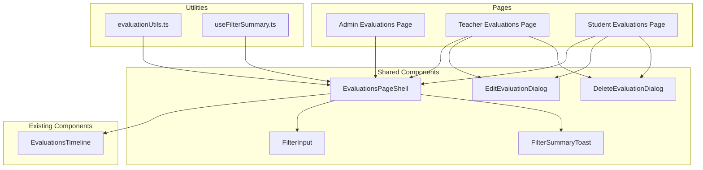

# Evaluation Pages Refactoring Design

## Executive Summary

This document outlines a refactoring approach to eliminate code duplication across three evaluation pages while preserving their unique features. The refactoring will extract shared components, utilities, and state management patterns.

## Current State Analysis

### Files Analyzed

| Page    | Path                                                                                                                 | Lines of Code |
| ------- | -------------------------------------------------------------------------------------------------------------------- | ------------- |
| Admin   | [`src/routes/admin/evaluations/+page.svelte`](src/routes/admin/evaluations/+page.svelte)                             | 167           |
| Teacher | [`src/routes/evaluations/+page.svelte`](src/routes/evaluations/+page.svelte)                                         | 326           |
| Student | [`src/routes/evaluations/student/[studentId]/+page.svelte`](src/routes/evaluations/student/[studentId]/+page.svelte) | 471           |

### Duplication Analysis

#### 1. State Management Patterns

**Identical across all 3 pages:**

```typescript
// Sorting and display toggles
let sortAscending = $state(false);
let showDetails = $state(false);

// Filter summary with timeout
let showSummary = $state(false);
let summaryTimeout: ReturnType<typeof setTimeout>;

$effect(() => {
	if (filterValue) {
		showSummary = true;
		clearTimeout(summaryTimeout);
		summaryTimeout = setTimeout(() => {
			showSummary = false;
		}, 3000);
	} else {
		showSummary = false;
	}
});
```

**Filter states vary by page:**

| Page    | Filter State                     |
| ------- | -------------------------------- |
| Admin   | `studentFilter`, `teacherFilter` |
| Teacher | `studentFilter`                  |
| Student | `teacherFilter`                  |

#### 2. Function Duplication

**`transformEvaluation()` - Nearly identical in all 3 pages:**

```typescript
// Admin page version
function transformEvaluation(e: {...}): EvaluationEntry {
  return {
    _id: e._id,
    value: e.value,
    category: e.category,
    subCategory: e.subCategory,
    details: e.details,
    timestamp: e.timestamp,
    englishName: e.englishName,
    grade: e.grade,
    studentId: e.studentId,
    studentIdCode: e.studentIdCode,
    teacherName: e.teacherName,
    status: e.status
  };
}

// Teacher page adds: teacherId, isAdmin: false
// Student page adds: teacherId, isAdmin (from data)
```

**Sorting logic - Identical pattern:**

```typescript
const sortedEvaluations = $derived.by(() => {
	if (!evaluationsQuery.data) return [];
	const evals = evaluationsQuery.data.map(transformEvaluation);
	return sortAscending
		? [...evals].sort((a, b) => a.timestamp - b.timestamp)
		: [...evals].sort((a, b) => b.timestamp - a.timestamp);
});
```

**Edit/Delete handlers - Identical in Teacher and Student pages:**

```typescript
function handleLongPress(entry: EvaluationEntry): void {
	selectedEvaluation = entry;
	editValue = entry.value;
	editCategory = entry.category;
	editSubCategory = entry.subCategory || '';
	editDetails = entry.details || '';
	editDialogOpen = true;
}

async function handleEditConfirm(): Promise<void> {
	/* ... */
}
async function handleDeleteConfirm(): Promise<void> {
	/* ... */
}
function canEditEntry(entry: EvaluationEntry): boolean {
	/* ... */
}
```

#### 3. UI Component Duplication

**Loading State - Identical markup:**

```svelte
<div class="text-muted-foreground flex items-center justify-center gap-2 py-16 text-center">
	<Loader class="size-5 animate-spin" />
	Loading evaluations...
</div>
```

**Error State - Identical markup:**

```svelte
<div class="bg-card border-destructive rounded-lg border p-8 text-center">
	<p class="text-destructive">Error loading evaluations: {error.message}</p>
</div>
```

**Empty State - Similar with variations:**

```svelte
<div class="bg-card border-input rounded-lg border p-8 text-center">
	<p class="text-muted-foreground mb-6">No evaluations found.</p>
	<!-- Optional button -->
</div>
```

**Filter Input - Identical pattern:**

```svelte
<div class="relative">
	<Funnel class="text-muted-foreground absolute top-1/2 left-3 size-4 -translate-y-1/2" />
	<Input type="text" placeholder="Filter by..." bind:value={filter} class="w-full pl-9 sm:w-64" />
</div>
```

**Filter Summary Toast - Identical markup:**

```svelte
{#if showSummary}
	<div class="fixed bottom-6 left-1/2 z-50 -translate-x-1/2">
		<p class="bg-card/90 rounded-full px-4 py-2 text-sm shadow-lg backdrop-blur-sm">
			Showing {count} evaluations...
		</p>
	</div>
{/if}
```

**Edit Dialog - Identical in Teacher and Student pages (~80 lines):**

- Category select
- SubCategory select
- Points buttons (-2, -1, +1, +2)
- Details textarea
- Footer with Cancel/Delete/Save buttons

**Delete Dialog - Identical in Teacher and Student pages (~15 lines):**

- Confirmation message
- Cancel/Delete buttons

### Page Differences Summary

| Feature         | Admin           | Teacher         | Student |
| --------------- | --------------- | --------------- | ------- |
| Edit/Delete     | ❌              | ✅              | ✅      |
| Student Filter  | ✅              | ✅              | ❌      |
| Teacher Filter  | ✅              | ❌              | ✅      |
| Show Unenrolled | ✅              | ❌              | ❌      |
| Demo Mode       | ❌              | ❌              | ✅      |
| New Button      | ❌              | ✅              | ❌      |
| Card Navigation | To student page | To student page | None    |

---

## Proposed Architecture

### Component Hierarchy



### New Files to Create

```
src/lib/components/evaluations/
├── index.ts                    # Public exports
├── EvaluationsPageShell.svelte # Loading/Error/Empty states wrapper
├── EditEvaluationDialog.svelte # Edit dialog with form
├── DeleteEvaluationDialog.svelte # Delete confirmation dialog
├── FilterInput.svelte          # Reusable filter input with icon
├── FilterSummaryToast.svelte   # Filter summary toast
└── types.ts                    # Shared types

src/lib/utils/
└── evaluationUtils.ts          # transformEvaluation, sorting helpers

src/lib/stores/
└── useFilterSummary.ts         # Filter summary state management
```

---

## Detailed Component Specifications

### 1. EvaluationsPageShell Component

**Purpose:** Wrap EvaluationsTimeline with consistent loading/error/empty states.

**Props Interface:**

```typescript
interface Props {
	// Query state
	isLoading: boolean;
	error: Error | null;
	evaluations: EvaluationEntry[];

	// Timeline props
	showStudentName?: boolean;
	showTeacherName?: boolean;
	studentGrade?: number;
	enableCardClick?: boolean;
	cardHref?: (entry: EvaluationEntry) => string;

	// Bindable state
	sortAscending?: boolean;
	showDetails?: boolean;

	// Admin-specific
	showUnenrolled?: boolean;
	onToggleShowUnenrolled?: () => void;

	// Edit/Delete (optional)
	enableLongPress?: boolean;
	onLongPress?: (entry: EvaluationEntry) => void;
	canEditEntry?: (entry: EvaluationEntry) => boolean;

	// Customization
	loadingText?: string;
	emptyText?: string;
	emptyAction?: Snippet;

	// Slot for filters
	children?: Snippet;
}
```

**Usage Example:**

```svelte
<EvaluationsPageShell
	isLoading={evaluationsQuery.isLoading}
	error={evaluationsQuery.error}
	evaluations={sortedEvaluations}
	showStudentName={true}
	showTeacherName={true}
	bind:sortAscending
	bind:showDetails
	loadingText="Loading evaluations..."
	emptyText="No evaluations found."
>
	{#snippet children()}
		<!-- Filter controls here -->
	{/snippet}
</EvaluationsPageShell>
```

### 2. EditEvaluationDialog Component

**Purpose:** Reusable edit dialog for evaluations.

**Props Interface:**

```typescript
interface Props {
	open: boolean;
	onOpenChange: (open: boolean) => void;
	evaluation: EvaluationEntry | null;
	categories: Category[];
	onSave: (data: EditData) => Promise<void>;
	onDelete: () => void;
	isDemo?: boolean;
}

interface EditData {
	value: number;
	category: string;
	subCategory: string;
	details: string;
}
```

**Usage Example:**

```svelte
<EditEvaluationDialog
	bind:open={editDialogOpen}
	evaluation={selectedEvaluation}
	categories={categoriesQuery.data || []}
	onSave={handleEditConfirm}
	onDelete={() => {
		editDialogOpen = false;
		deleteDialogOpen = true;
	}}
/>
```

### 3. DeleteEvaluationDialog Component

**Purpose:** Reusable delete confirmation dialog.

**Props Interface:**

```typescript
interface Props {
	open: boolean;
	onOpenChange: (open: boolean) => void;
	onConfirm: () => Promise<void>;
	isDemo?: boolean;
}
```

### 4. FilterInput Component

**Purpose:** Reusable filter input with funnel icon.

**Props Interface:**

```typescript
interface Props {
	value: string;
	onchange: (value: string) => void;
	placeholder: string;
	ariaLabel?: string;
	class?: string;
}
```

### 5. FilterSummaryToast Component

**Purpose:** Display filter summary with auto-hide.

**Props Interface:**

```typescript
interface Props {
	show: boolean;
	count: number;
	total?: number;
	filterValue: string;
	filterLabel?: string;
}
```

### 6. Utility Functions

**evaluationUtils.ts:**

```typescript
// Transform API response to EvaluationEntry
export function transformEvaluation(e: {
	_id: string;
	value: number;
	category: string;
	subCategory?: string;
	details?: string;
	timestamp: number;
	englishName?: string;
	grade?: number;
	studentId?: string;
	studentIdCode?: string;
	teacherName?: string;
	teacherId?: string;
	status?: 'Enrolled' | 'Not Enrolled';
	isAdmin?: boolean;
}): EvaluationEntry {
	return {
		_id: e._id,
		value: e.value,
		category: e.category,
		subCategory: e.subCategory,
		details: e.details,
		timestamp: e.timestamp,
		englishName: e.englishName,
		grade: e.grade,
		studentId: e.studentId,
		studentIdCode: e.studentIdCode,
		teacherName: e.teacherName,
		teacherId: e.teacherId,
		status: e.status,
		isAdmin: e.isAdmin
	};
}

// Sort evaluations by timestamp
export function sortEvaluations(
	evaluations: EvaluationEntry[],
	ascending: boolean
): EvaluationEntry[] {
	return [...evaluations].sort((a, b) =>
		ascending ? a.timestamp - b.timestamp : b.timestamp - a.timestamp
	);
}

// Multi-search filter helper
export function matchesMultiSearch(filter: string, value: string): boolean {
	if (!filter.trim()) return true;
	const searchTerms = filter
		.split(',')
		.map((s) => s.trim().toLowerCase())
		.filter(Boolean);
	if (searchTerms.length === 0) return true;
	return searchTerms.some((term) => value.toLowerCase().includes(term));
}
```

### 7. useFilterSummary Store

**Purpose:** Manage filter summary state with auto-hide timeout.

**Implementation:**

```typescript
// src/lib/stores/useFilterSummary.ts
export function createFilterSummaryState() {
	let showSummary = $state(false);
	let summaryTimeout = $state<ReturnType<typeof setTimeout> | null>(null);

	function updateSummary(hasFilter: boolean): void {
		if (hasFilter) {
			showSummary = true;
			if (summaryTimeout) clearTimeout(summaryTimeout);
			summaryTimeout = setTimeout(() => {
				showSummary = false;
			}, 3000);
		} else {
			showSummary = false;
			if (summaryTimeout) {
				clearTimeout(summaryTimeout);
				summaryTimeout = null;
			}
		}
	}

	return {
		get showSummary() {
			return showSummary;
		},
		updateSummary
	};
}
```

---

## Implementation Steps

### Phase 1: Create Utility Functions

1. Create [`src/lib/utils/evaluationUtils.ts`](src/lib/utils/evaluationUtils.ts)
   - Export `transformEvaluation()`
   - Export `sortEvaluations()`
   - Export `matchesMultiSearch()`

2. Create [`src/lib/stores/useFilterSummary.ts`](src/lib/stores/useFilterSummary.ts)
   - Export `createFilterSummaryState()`

### Phase 2: Create Shared Components

1. Create [`src/lib/components/evaluations/FilterInput.svelte`](src/lib/components/evaluations/FilterInput.svelte)
   - Simple, presentational component
   - Unit test with vitest-browser-svelte

2. Create [`src/lib/components/evaluations/FilterSummaryToast.svelte`](src/lib/components/evaluations/FilterSummaryToast.svelte)
   - Presentational component
   - Unit test with vitest-browser-svelte

3. Create [`src/lib/components/evaluations/DeleteEvaluationDialog.svelte`](src/lib/components/evaluations/DeleteEvaluationDialog.svelte)
   - Extract from existing pages
   - Unit test dialog interactions

4. Create [`src/lib/components/evaluations/EditEvaluationDialog.svelte`](src/lib/components/evaluations/EditEvaluationDialog.svelte)
   - Extract from existing pages
   - Unit test form interactions

5. Create [`src/lib/components/evaluations/EvaluationsPageShell.svelte`](src/lib/components/evaluations/EvaluationsPageShell.svelte)
   - Compose with EvaluationsTimeline
   - Handle loading/error/empty states

6. Create [`src/lib/components/evaluations/index.ts`](src/lib/components/evaluations/index.ts)
   - Export all components

### Phase 3: Refactor Pages

1. **Refactor Admin Page First** (simplest, no dialogs)
   - Replace loading/error/empty markup with EvaluationsPageShell
   - Replace filter inputs with FilterInput component
   - Replace filter summary with FilterSummaryToast
   - Use utility functions

2. **Refactor Teacher Page**
   - Replace loading/error/empty markup with EvaluationsPageShell
   - Replace Edit/Delete dialogs with shared components
   - Use utility functions

3. **Refactor Student Page** (most complex)
   - Replace loading/error/empty markup with EvaluationsPageShell
   - Replace Edit/Delete dialogs with shared components
   - Handle demo mode in shared components
   - Use utility functions

### Phase 4: Testing

1. Update existing E2E tests to verify functionality preserved
2. Add unit tests for new components
3. Run full test suite: `bun run test:all`

---

## Migration Strategy

### Approach: Incremental Refactoring

1. **Create new components without modifying existing pages**
   - All new files in `src/lib/components/evaluations/`
   - Unit test each component in isolation

2. **Refactor one page at a time**
   - Start with Admin (simplest)
   - Then Teacher (medium complexity)
   - Finally Student (most complex)

3. **Run tests after each page refactor**
   - E2E tests should pass unchanged
   - Visual regression if available

### Rollback Plan

Each page refactor is independent. If issues arise:

1. Revert the specific page file
2. Shared components remain for other pages
3. No database or API changes required

### Breaking Changes

**None expected.** This is purely a frontend refactoring:

- No API changes
- No route changes
- No user-facing behavior changes

---

## Code Reduction Estimates

| File         | Before        | After          | Reduction |
| ------------ | ------------- | -------------- | --------- |
| Admin Page   | 167 lines     | ~80 lines      | ~52%      |
| Teacher Page | 326 lines     | ~100 lines     | ~69%      |
| Student Page | 471 lines     | ~200 lines     | ~57%      |
| **Total**    | **964 lines** | **~380 lines** | **~61%**  |

New shared code: ~250 lines (components + utilities)

**Net reduction:** ~334 lines of code while improving maintainability.

---

## Risks and Mitigations

| Risk                             | Mitigation                                      |
| -------------------------------- | ----------------------------------------------- |
| Behavior changes during refactor | Comprehensive E2E test coverage exists          |
| Demo mode breaks                 | Test demo mode explicitly in Student page tests |
| Dialog state management issues   | Use consistent patterns from existing code      |
| Performance regression           | No new reactive dependencies introduced         |

---

## Success Criteria

1. ✅ All existing E2E tests pass
2. ✅ No visual regressions
3. ✅ Code duplication reduced by >50%
4. ✅ Each page maintains its unique features
5. ✅ New components have unit test coverage

---

## Appendix: Page-Specific Features to Preserve

### Admin Page Features

- [ ] Student filter input
- [ ] Teacher filter input
- [ ] Show unenrolled toggle
- [ ] Card navigation to student page
- [ ] No edit/delete functionality

### Teacher Page Features

- [ ] Student filter input
- [ ] New evaluation button
- [ ] Card navigation to student page
- [ ] Edit own evaluations only
- [ ] Delete own evaluations only

### Student Page Features

- [ ] Teacher filter input
- [ ] Demo mode support
- [ ] No card navigation (stays on page)
- [ ] Edit own evaluations only
- [ ] Delete own evaluations only
- [ ] Dynamic header title
