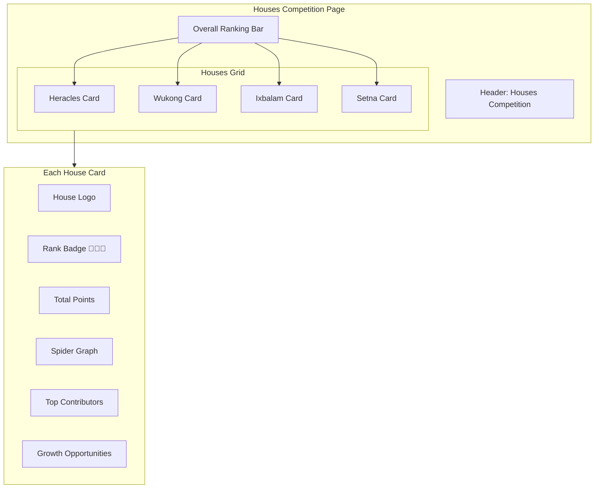

# Houses Competition Page - Implementation Plan

## Overview

Create a comprehensive view-only houses page for students and teachers/administrators to view the four houses: Heracles, Wukong, Ixbalam, and Setna. The page fosters healthy competition and encourages students to improve their performance.

## Data Model Understanding

### Existing Schema

- **students**: has `house` field (Heracles, Wukong, Ixbalam, Setna)
- **evaluations**: has `studentId`, `value` (points, can be positive/negative), `categoryId`
- **point_categories**: has `name`, `meritCriteria`, `demeritCriteria`

### Points Calculation

- Positive values = merits/rewards
- Negative values = demerits/points lost
- Points are grouped by category

## Feature Requirements

### 1. House Statistics Query (Convex)

Create a new query `getHouseStats` in `students.ts` that returns:

```typescript
type HouseStats = {
	house: House;
	totalPoints: number;
	pointsByCategory: Record<string, number>;
	studentCount: number;
	topContributors: {
		studentId: string;
		englishName: string;
		totalPoints: number;
		positivePoints: number;
	}[];
	needsImprovement: {
		studentId: string;
		englishName: string;
		totalPoints: number;
		pointsLost: number;
	}[];
};

type HousesStats = {
	houses: HouseStats[];
	ranking: House[]; // houses ordered by totalPoints desc
	categories: string[]; // all category names
};
```

### 2. Houses Page UI (src/routes/houses/+page.svelte)

#### Layout

- Responsive grid: 2x2 on desktop, 1 column on mobile
- Each house card contains:
  - House logo (reuse from admin/houses)
  - House name with rank badge (gold/silver/bronze for top 3)
  - Total points display
  - Student count
  - Spider/radar chart for category breakdown
  - Top contributors list (expandable)
  - "Growth opportunity" list (students who lost points, framed positively)

#### Visual Design

- House colors (already defined in admin/houses):
  - Heracles: red
  - Wukong: amber
  - Ixbalam: emerald
  - Setna: blue
- Gold (🥇), Silver (🥈), Bronze (🥉) badges for top 3
- Motivational language for negative points: "Growth Opportunities" instead of "Points Lost"

#### Accessibility

- Semantic HTML
- ARIA labels
- Keyboard navigation
- Color-blind friendly (use icons + colors)

### 3. Navigation

- Add link to houses page in main navigation
- Link in layout.ts for unauthenticated students

## Implementation Steps

### Step 1: Add Convex Query

- File: `src/convex/students.ts`
- Function: `getHouseStats`
- Logic:
  1. Get all students with houses
  2. Get all evaluations for those students
  3. Group by house
  4. Calculate totals and rankings

### Step 2: Create Houses Page

- File: `src/routes/houses/+page.svelte`
- Use existing house logos
- Create spider chart component (use Chart.js or similar)

### Step 3: Add Navigation

- Update layout to include Houses link

### Step 4: Testing

- Unit tests for Convex query
- Component tests for page rendering
- E2E tests for integration

## Mermaid Diagram - Page Layout



## Technical Notes

### Spider Chart Options

1. Use Chart.js with radar chart
2. Or create custom SVG spider chart
3. Categories as axes

### Performance Considerations

- Cache house stats (Convex handles this)
- Limit student lists to top 10
- Lazy load full student lists

### Security

- Page should be viewable by all authenticated users
- No mutations (view-only)
