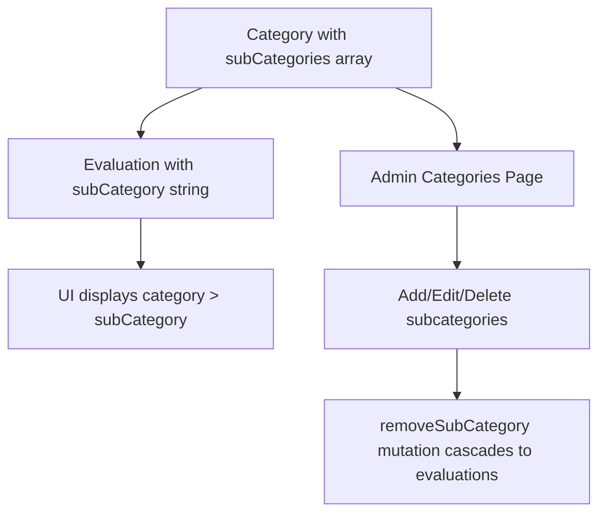

# Subcategory Removal Analysis

## Executive Summary

This document provides a comprehensive analysis of all files that need to be modified to remove the subcategory feature from the HWIS application. The subcategory feature is currently embedded in both the database schema and UI components, requiring changes across multiple layers of the application.

## Current State

### Database Schema (`src/convex/schema.ts`)

The subcategory feature is implemented as:

1. **`point_categories` table**: Contains `subCategories: v.array(v.string())` field
2. **`evaluations` table**: Contains `subCategory: v.string()` field
3. **Index**: `by_categoryId_subCategory` index on evaluations table

### Data Flow

---

## Files Requiring Changes

### 1. Schema/Data Model Files

| File | Changes Needed | Risk Level |
|------|----------------|------------|
| [`src/convex/schema.ts`](src/convex/schema.ts) | Remove `subCategories` field from `point_categories`, remove `subCategory` field from `evaluations`, remove `by_categoryId_subCategory` index | **HIGH** - Breaking change |

**Specific Changes:**
- Line 75: Remove `subCategories: v.array(v.string())`
- Line 84: Remove `subCategory: v.string()`
- Line 95: Remove `.index('by_categoryId_subCategory', ['categoryId', 'subCategory'])`

---

### 2. Convex Function Files

#### [`src/convex/categories.ts`](src/convex/categories.ts)

| Function | Changes Needed |
|----------|----------------|
| `getSubCategoryEvaluationCount` | **REMOVE ENTIRE FUNCTION** (lines 30-47) |
| `seed` | Remove `subCategories` from seed data (lines 59-66) |
| `create` | Remove `subCategories` argument and field (lines 74-100) |
| `update` | Remove `subCategories` argument and field (lines 102-116) |
| `removeSubCategory` | **REMOVE ENTIRE FUNCTION** (lines 144-175) |

#### [`src/convex/evaluations.ts`](src/convex/evaluations.ts)

| Function | Changes Needed |
|----------|----------------|
| `create` | Remove `subCategory` argument (line 26) and field assignment (line 51) |
| `listByStudent` | Remove `subCategory` from return object (line 187) |
| `listAllEvaluations` | Remove `subCategory` from return object (line 644) |
| `listAllEvaluationsPaginated` | Remove `subCategory` from return object |
| `update` | Remove `subCategory` argument (line 774) and update logic (line 803) |

#### [`src/convex/audit.ts`](src/convex/audit.ts)

| Location | Changes Needed |
|----------|----------------|
| Line 33 | Remove `subCategory` from `Evaluation` interface |
| Line 83 | Remove `subCategory` from return type |
| Line 94 | Remove `subCategory` variable declaration |
| Line 126 | Remove `subCategory` assignment |
| Line 150 | Remove `subCategory` from return object |

---

### 3. UI Components (Svelte Files)

#### [`src/routes/admin/categories/+page.svelte`](src/routes/admin/categories/+page.svelte)

**Major Refactoring Required:**

| Lines | Changes Needed |
|-------|----------------|
| 19 | Remove `subCategories` state |
| 20 | Remove `newSubCategory` state |
| 26-27 | Remove `subCategories` from category type |
| 28-32 | Remove `subCategoryWarning` and `subCategoryToDelete` state |
| 46-47 | Remove `subCategories` reset in `startAdd()` |
| 54-58 | Remove `subCategories` handling in `startEdit()` |
| 66-68 | Remove `subCategories` and `subCategoryToDelete` reset |
| 86, 96 | Remove `subCategories` from mutation calls |
| 107-136 | **REMOVE** `addSubCategory()` and `removeSubCategory()` functions |
| 139-163 | **REMOVE** `cancelSubCategoryDelete()` and `confirmSubCategoryDelete()` functions |
| 171-172 | Remove `subCategories` from `confirmDelete()` |
| 180-183 | Remove `subCategoryWarning` assignment |
| 228 | Remove Sub-Categories table header |
| 239-246 | **REMOVE** Sub-Categories display cell |
| 328-361 | **REMOVE** Sub-Categories form section |
| 388-393 | Update warning message (remove subCategory reference) |
| 404-432 | **REMOVE** SubCategory delete confirmation dialog |

#### [`src/routes/evaluations/new/+page.svelte`](src/routes/evaluations/new/+page.svelte)

| Lines | Changes Needed |
|-------|----------------|
| 27 | Remove `subCategory` state |
| 56-58 | Remove `resolvedSubCategory` derived state |
| 69-72 | Remove subcategory validation check |
| 82 | Remove `subCategory` from mutation call |
| 300-320 | **REMOVE** Sub-Category selection UI block |

#### [`src/lib/evaluations/components/EditEvaluationDialog.svelte`](src/lib/evaluations/components/EditEvaluationDialog.svelte)

| Lines | Changes Needed |
|-------|----------------|
| 26 | Remove `editSubCategory` state |
| 35 | Remove `editSubCategory` assignment |
| 52 | Remove `subCategory` from mutation call |
| 116-131 | **REMOVE** SubCategory selection UI block |

#### [`src/routes/admin/audit/+page.svelte`](src/routes/admin/audit/+page.svelte)

| Lines | Changes Needed |
|-------|----------------|
| 28 | Remove `subCategory` from column type |
| 53 | Remove `subCategory` from log type |
| 69-70 | **REMOVE** Subcategory column definition |
| 330-331 | **REMOVE** Column width case |
| 344, 358 | **REMOVE** Column cases |
| 552-553 | **REMOVE** Subcategory display logic |

#### [`src/lib/components/timeline/EvaluationsTimeline.svelte`](src/lib/components/timeline/EvaluationsTimeline.svelte)

| Lines | Changes Needed |
|-------|----------------|
| 300-302 | **REMOVE** SubCategory display in timeline entry |

#### [`src/lib/components/timeline/types.ts`](src/lib/components/timeline/types.ts)

| Lines | Changes Needed |
|-------|----------------|
| 6 | Remove `subCategory?: string` field |

#### [`src/routes/evaluations/student/[studentId]/+page.svelte`](src/routes/evaluations/student/[studentId]/+page.svelte)

| Lines | Changes Needed |
|-------|----------------|
| 78-113 | Update mock data to remove `subCategory` fields |

---

### 4. Utility and Helper Files

#### [`src/lib/e2e-utils.ts`](src/lib/e2e-utils.ts)

| Lines | Changes Needed |
|-------|----------------|
| 65 | Remove `subCategories` from `CreateCategoryOptions` interface |
| 71 | Remove `subCategories` from return type |

#### [`src/lib/evaluations/utils.ts`](src/lib/evaluations/utils.ts)

| Lines | Changes Needed |
|-------|----------------|
| 9 | Remove `subCategory` from interface |
| 26 | Remove `subCategory` from return object |

---

### 5. Test Files

#### Unit Tests: [`src/convex/categories.test.ts`](src/convex/categories.test.ts)

**Major Changes Required:**
- Remove tests for `subCategories` in create/update tests
- **REMOVE** entire `describe('categories.removeSubCategory')` block (lines 406-604)
- **REMOVE** `describe('categories.getSubCategoryEvaluationCount')` block (lines 261-320)
- Update all test data to remove `subCategories` arrays

#### Unit Tests: [`src/convex/evaluations.test.ts`](src/convex/evaluations.test.ts)

- Remove `subCategory` from all test data
- Update all test assertions that check `subCategory`

#### Unit Tests: [`src/convex/backup.test.ts`](src/convex/backup.test.ts)

- Remove `subCategories` from category test data
- Remove `subCategory` from evaluation test data

#### Unit Tests: [`src/convex/students.test.ts`](src/convex/students.test.ts)

- Remove `subCategories` from category test data
- Remove `subCategory` from evaluation test data

#### Unit Tests: [`src/convex/weekly-reports.test.ts`](src/convex/weekly-reports.test.ts)

- Remove `subCategories` from category test data
- Remove `subCategory` from evaluation test data

#### Unit Tests: [`src/convex/testUtilities.test.ts`](src/convex/testUtilities.test.ts)

- Remove `subCategories` from category test data
- Remove `subCategory` from evaluation test data

#### Unit Tests: [`src/convex/audit.test.ts`](src/convex/audit.test.ts)

- Update tests that verify `subCategory` in audit logs

#### E2E Tests: [`e2e/categories.spec.ts`](e2e/categories.spec.ts)

- **REMOVE** "Categories - SubCategory Cascade" test block (lines 189-257)
- Update `createCategoryWithSubs` calls to `createCategory`
- Remove `subCategories` from test data

#### E2E Tests: [`e2e/evaluations.spec.ts`](e2e/evaluations.spec.ts)

- Remove subcategory selection steps from test flows
- Update `createCategoryWithSubs` calls

#### E2E Tests: [`e2e/bulk-operations.spec.ts`](e2e/bulk-operations.spec.ts)

- Remove subcategory selection steps (lines 105-110)
- Update test data

#### E2E Tests: [`e2e/integration.spec.ts`](e2e/integration.spec.ts)

- Remove `subCategories` from category creation
- Remove subcategory selection steps

#### E2E Tests: [`e2e/students/crud.spec.ts`](e2e/students/crud.spec.ts)

- Remove `subCategories` from category creation

#### E2E Tests: [`e2e/weekly-reports.spec.ts`](e2e/weekly-reports.spec.ts)

- Remove `subCategories` from category creation
- Remove subcategory selection steps

#### E2E Tests: [`e2e/student-timeline.spec.ts`](e2e/student-timeline.spec.ts)

- Remove `subCategories` from category creation

#### E2E Tests: [`e2e/evaluations-teacher-permissions.spec.ts`](e2e/evaluations-teacher-permissions.spec.ts)

- Remove `subCategories` from category creation

---

### 6. Data Factory and Seed Files

#### [`src/convex/dataFactory.ts`](src/convex/dataFactory.ts)

| Lines | Changes Needed |
|-------|----------------|
| 167-178 | Remove `subCategories` from default categories |
| 314-323 | Remove `subCategories` from `createCategory` helper |
| 333 | Remove `subCategory` assignment |
| 427-438 | Remove `subCategories` from `createCategoryWithE2eTag` |
| 445-456 | Remove `subCategories` from `createCategoryWithSubs` |

#### [`src/convex/resetDb.ts`](src/convex/resetDb.ts)

| Lines | Changes Needed |
|-------|----------------|
| 77-87 | Remove `subCategories` from seed categories |
| 86 | Remove `subCategories` from insert |

#### [`src/convex/testE2E.ts`](src/convex/testE2E.ts)

| Lines | Changes Needed |
|-------|----------------|
| 83-94 | Remove `subCategories` from seed categories |
| 191-204 | Remove `subCategory` from evaluation creation |
| 266-273 | Remove `subCategories` from category creation |
| 290-323 | Update category/evaluation creation logic |
| 425-443 | Remove `subCategories` from category creation |
| 525-558 | Remove `subCategories` and `subCategory` from test helpers |

#### [`src/convex/testData/weeklyReports.ts`](src/convex/testData/weeklyReports.ts)

| Lines | Changes Needed |
|-------|----------------|
| 60-75 | Remove `subCategories` from category configs |
| 146-162 | Remove `subCategories` from category creation |
| 211-215 | Remove `subCategory` selection logic |
| 242-244 | Remove `subCategory` from evaluation creation |

#### [`src/convex/backup.ts`](src/convex/backup.ts)

| Lines | Changes Needed |
|-------|----------------|
| 89 | Remove `subCategory` from backup type |
| 93 | Remove `subCategories` from backup type |
| 123 | Remove `subCategory` from backup data |
| 140 | Remove `subCategories` from backup data |

---

### 7. E2E Helper Files

#### [`e2e/convex-client.ts`](e2e/convex-client.ts)

| Lines | Changes Needed |
|-------|----------------|
| 155-157 | Remove `subCategories` from `CreateCategoryOptions` |
| 164-166 | Remove `subCategories` from return type |
| 193-195 | Remove `subCategories` from default |

---

### 8. Documentation Files

#### [`docs/category-evaluation-integrity.md`](docs/category-evaluation-integrity.md)

This file documents the subcategory integrity patterns. It should be reviewed and updated or removed since subcategories are being removed.

#### [`TESTING.md`](TESTING.md)

| Lines | Changes Needed |
|-------|----------------|
| 507 | Update `createCategoryWithSubs` reference |
| 1071 | Update categories test description |

---

### 9. Generated/Build Files (Auto-regenerated)

These files will be automatically regenerated after schema changes:
- `.svelte-kit/output/server/chunks/*.js`
- `.svelte-kit/output/client/_app/immutable/chunks/*.js`
- `src/convex/_generated/api.d.ts`
- `src/convex/_generated/dataModel.d.ts`
- `src/convex/_generated/server.d.ts`

---

## Migration Strategy

### Phase 1: Schema Migration

1. Create a migration to:
   - Remove `subCategories` field from all `point_categories` documents
   - Remove `subCategory` field from all `evaluations` documents
   - Drop the `by_categoryId_subCategory` index

### Phase 2: Backend Updates

1. Update `schema.ts` first
2. Run `npx convex dev` to regenerate types
3. Update all Convex functions in order:
   - `categories.ts` (remove functions and arguments)
   - `evaluations.ts` (remove arguments and fields)
   - `audit.ts` (remove fields)
   - `dataFactory.ts`, `resetDb.ts`, `testE2E.ts`, `backup.ts`

### Phase 3: Frontend Updates

1. Update type definitions (`types.ts`)
2. Update utility functions (`utils.ts`)
3. Update UI components:
   - `EditEvaluationDialog.svelte`
   - `+page.svelte` files (categories, evaluations/new, audit, etc.)
   - `EvaluationsTimeline.svelte`

### Phase 4: Test Updates

1. Update unit tests
2. Update E2E tests
3. Update test helpers

---

## Risk Assessment

### High Risk Areas

1. **Database Migration**: Existing evaluations with `subCategory` values will lose that data
2. **Index Removal**: The `by_categoryId_subCategory` index removal requires data migration
3. **Cascading Deletes**: The `removeSubCategory` function currently handles cascade deletes - this logic will be removed

### Medium Risk Areas

1. **UI Forms**: Multiple forms reference subcategory state and validation
2. **Test Coverage**: Extensive test changes required, risk of missing updates

### Low Risk Areas

1. **Generated Files**: Will auto-regenerate
2. **Documentation**: Can be updated after implementation

---

## Dependencies to Consider

1. **Existing Data**: Any production data with subcategories will need migration
2. **Audit Logs**: Historical audit logs may reference subcategories
3. **Backup/Restore**: Backup format includes subcategory data

---

## Estimated File Count

| Category | File Count |
|----------|------------|
| Schema/Data Model | 1 |
| Convex Functions | 8 |
| UI Components | 7 |
| Test Files | 12 |
| Utility Files | 3 |
| Documentation | 2 |
| **Total** | **33 files** |

---

## Recommendations

1. **Create a backup** before starting migration
2. **Implement in phases** with testing between each phase
3. **Consider data migration script** for existing production data
4. **Update documentation** after implementation is complete
5. **Run full test suite** after all changes are made
